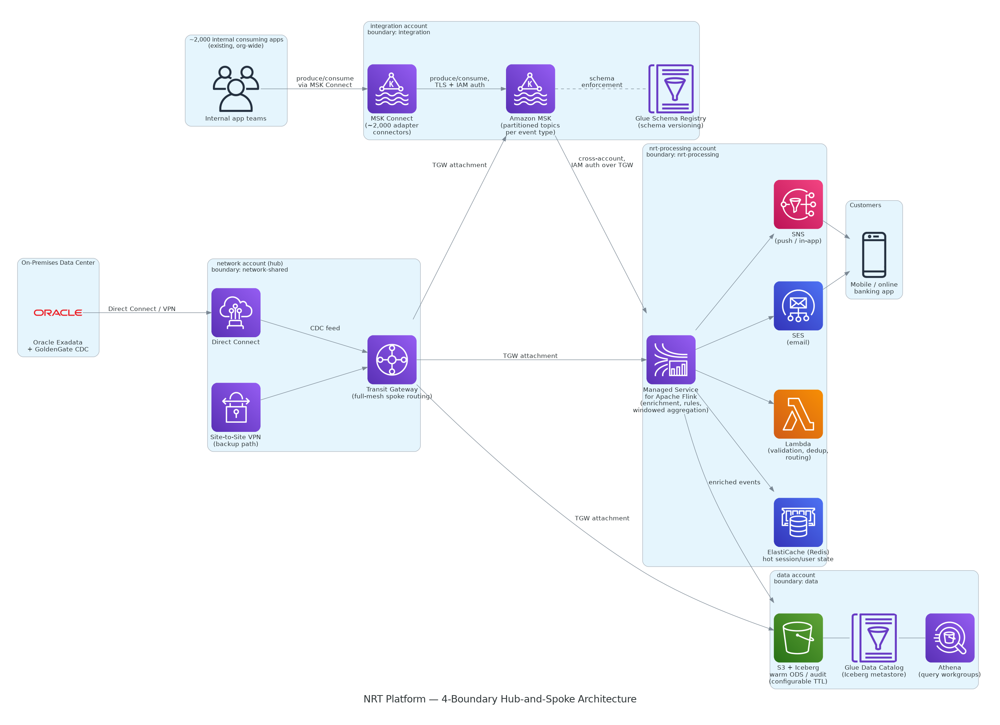
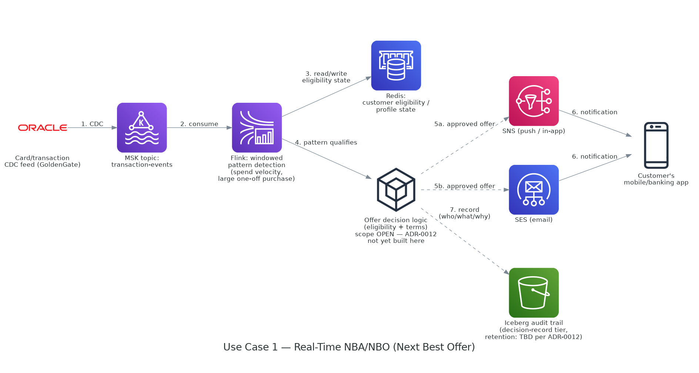
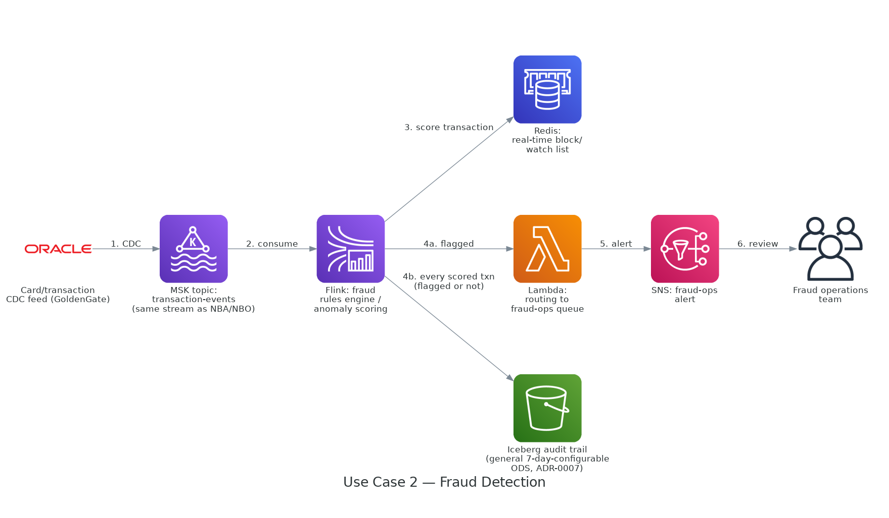
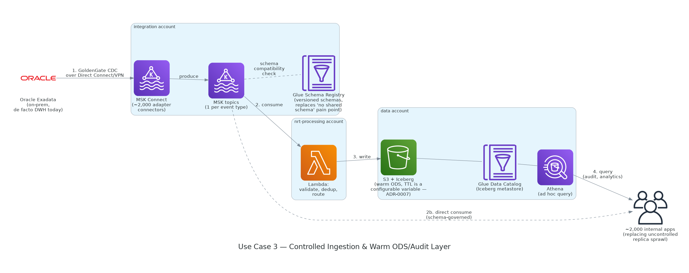

# NRT Platform on AWS — Infrastructure Blueprint

Terraform for the organization's AWS-native near-real-time (NRT) data platform: MSK, Flink, Lambda,
S3/Iceberg/Athena, ElastiCache, and notification plumbing. This repo provisions the
*runtime* the platform runs on; data engineering owns the code (Flink jobs, Lambda
functions, event schemas) deployed into it — see "Boundary with data engineering" in
`ARCHITECTURE.md`.

See `ARCHITECTURE.md` for full project context, module boundaries, and the current status of every
open architecture decision. This README gives a higher-level picture — the problem being
solved, what gets deployed, and how data moves through it for a few concrete use cases — and
defers to `ARCHITECTURE.md`/`docs/architecture-decisions/` wherever the two could drift, since that
file is updated every time a stub gets built out and this one is not.

## The problem this solves

About 2,000 internal apps at the organization currently read data off uncontrolled replicas of an
on-prem Oracle Exadata instance that has become a de facto data warehouse. The existing
near-real-time pattern — GoldenGate CDC → Kafka → one-off consumers per use case — works, but
it has no shared event schema, no lineage, and every product team ends up maintaining its own
data model. A 7-day-retention on-prem ODS used for audit is also expensive, purely because of
where it lives, not because of a regulatory floor (see ADR-0007).

This platform doesn't replace that stack — AWS, Databricks, Snowflake, and Kafka are already
in use elsewhere in the org, and Databricks in particular stays out of scope entirely
(ADR-0010). What it does is give the on-prem CDC feed a governed, AWS-native path: partitioned
Kafka topics with enforced schema versioning, a stream-processing layer for enrichment and
pattern detection, hot state for sub-millisecond lookups, and a queryable warm audit layer
with retention you can actually tune instead of one inherited from old on-prem storage costs.

**Primary driving use case**: real-time contextual marketing / Next Best Action (NBA), also
called next-best-offer (NBO) — detecting a spend pattern in the transaction stream (three
purchases at the same retailer in a week, one large one-off purchase) and surfacing a
pre-approved offer (installment/BNPL split, credit line increase) within seconds, the way
Amex Plan It or Chase My Chase Plan do off their card-transaction streams. Fraud detection was
this project's original illustrative example and remains a valid secondary use case on the
same pipeline shape, but NBA/NBO is the one the design is validated against — see ADR-0012 for
the open compliance-scope question this raises (who is allowed to own the actual
credit-eligibility decision logic).

## What gets deployed

| Component | Role | Boundary account |
|---|---|---|
| Amazon MSK + MSK Connect | Partitioned topics per event type; ~2,000 adapter connectors front the existing app estate; TLS + IAM auth | `integration` |
| Glue Schema Registry | Schema versioning/compatibility enforcement in front of MSK topics | `integration` |
| Amazon Managed Service for Apache Flink | Stream enrichment, rules engine, windowed aggregation, NBA/NBO and fraud pattern detection | `nrt-processing` |
| AWS Lambda | Serverless micro-transforms: validation, dedup, routing | `nrt-processing` |
| ElastiCache (Redis) | Hot session/user state, sub-ms lookups | `nrt-processing` |
| SNS / SES | Push, in-app, and email notification delivery | `nrt-processing` |
| S3 + Iceberg + Glue Data Catalog + Athena | Warm ODS/audit layer, configurable retention (default was 7 days on-prem, no longer a hard floor — ADR-0007), queryable | `data` |
| Transit Gateway + Direct Connect/VPN | Hub routing between all four boundaries and the on-prem GoldenGate/Exadata source | `network` (hub) |

Every component above is provisioned per environment (`environments/{dev,staging,prod}`)
across four AWS accounts (or four logical boundaries collapsed into one account for a PoC) —
see ADR-0001 for why the account split exists and ADR-0002/0003 for why MSK and the on-prem
connectivity edge land where they do.

Not yet real, flagged so this doesn't get mistaken for done: customer-managed KMS keys
(`global/kms`) are still a stub every module already accepts a `kms_key_arn` variable for; the
OPA/Sentinel-style tag enforcement layer (`global/tagging-policy.tf`) is a comment only (tags
are enforced today by each module merging `mandatory_tags` directly); and `docs/data-contracts/`
is empty pending data engineering's input, which blocks real topic/table schemas. Full
up-to-date build status lives in `ARCHITECTURE.md`'s "Remaining Build-Out" section — check there
before assuming any of the above has shipped.

## Network / account architecture

Diagram source: `docs/diagrams/network-architecture.py` (regenerate with
`pip install diagrams --break-system-packages && python3 network-architecture.py` — requires
Graphviz's `dot` on `PATH`). Built with the `diagrams` library using real AWS Architecture
Icons rather than the project's usual Mermaid default, since a literal AWS-stencil rendering
was wanted here specifically.

Four boundary accounts, hub-and-spoke over a single Transit Gateway:

- **network (hub)** — owns the only on-prem edge (Direct Connect, with Site-to-Site VPN as a
  backup path) and routes every other boundary through the TGW. No application workloads live
  here.
- **integration** — MSK cluster and MSK Connect live together deliberately (ADR-0002): the
  ~2,000 adapter connectors are the widest, least-trusted surface in the platform, so the
  on-prem CDC path never crosses an account boundary before landing in Kafka. The Glue Schema
  Registry fronts the same topics.
- **nrt-processing** — Flink, Lambda, and Redis. A pure consumer of the MSK topics,
  cross-account over the TGW via MSK IAM auth — a misconfigured Flink job can only read what
  it's been granted, it can't reach into the ingestion boundary itself.
- **data** — S3/Iceberg/Glue/Athena. Mostly regional/managed services; the VPC here exists for
  private-endpoint access control rather than because Athena runs "inside" it.

## Data flow by use case

Three flows through the same core pipeline, in increasing order of how "finished" each one is
in this repo today.

### Use case 1 — Real-time NBA/NBO (primary use case)

The card/transaction CDC feed lands on an MSK topic, Flink watches it with a windowed
pattern-detection job (spend velocity, a single large purchase), and reads/writes customer
eligibility state in Redis. Where the diagram breaks from the others: the actual
**offer-decision step — is this customer eligible, on what terms — is drawn as an open box**,
because ADR-0012 hasn't resolved whether that logic is allowed to live in this repo's Flink/
Lambda code, must stay in a separate compliance-reviewed system, or is out of scope entirely.
It's a credit decision, which pulls in fair-lending/adverse-action obligations fraud detection
doesn't carry. Everything upstream of that box (MSK topic, Flink windowing, Redis state) is
identical regardless of how the ADR resolves and is safe to build now; the decision-audit
retention tier and the notification fan-out downstream of it are not yet built.

### Use case 2 — Fraud detection (secondary / original use case)

Same transaction stream, different consumer: Flink scores each event against fraud rules/
anomaly detection, writes to a real-time block/watch list in Redis, and routes flagged
transactions through Lambda to an SNS alert for the fraud-ops team. Unlike NBA/NBO, this
decision sits under existing fraud-ops authority rather than being a credit decision itself,
so it isn't gated by ADR-0012 — every scored transaction (flagged or not) lands in the general
7-day-configurable audit ODS from ADR-0007, no separate retention tier needed.

### Use case 3 — Controlled ingestion & warm ODS/audit layer (foundational)

The flow underneath both use cases above, and the one that most directly answers the "no
shared schema, no lineage, expensive on-prem ODS" problem from ARCHITECTURE.md. GoldenGate CDC
lands on MSK Connect, each event type gets its own MSK topic checked against the Glue Schema
Registry for compatibility, Lambda does validation/dedup/routing, and the result lands in
S3/Iceberg with a retention period that's a configurable variable rather than an inherited
7-day constant. The ~2,000 internal apps that used to read uncontrolled Oracle replicas
either consume the schema-governed topics directly or query the warm layer through Athena.

## Repo layout

- `environments/{dev,staging,prod}` — per-environment wiring (variables + module calls only)
- `modules/` — one module per infrastructure component
- `global/` — cross-cutting policy (tagging, KMS)
- `bootstrap/` — one-time, per-AWS-account state bucket + GitHub OIDC trust
- `scripts/` — operator scripts (`bootstrap-env.sh` — see `docs/operator-setup.md`)
- `docs/architecture-decisions/` — one ADR per non-obvious call
- `docs/data-contracts/` — canonical event schemas per topic, owned jointly with data
  engineering (currently empty — see "What gets deployed" above)
- `docs/diagrams/` — architecture/data-flow diagrams and the scripts that generate them
- `docs/` — start with `docs/operator-setup.md` (workstation setup) and `docs/deployment.md`
  (bootstrap/plan/apply walkthrough)

## Compliance note

Per `ARCHITECTURE.md`: this is a regulated-industry environment, so nothing in this README, the diagrams, or the
Terraform itself uses real account IDs, ARNs, CIDR ranges, or hostnames — every diagram above
is logical/illustrative only.
